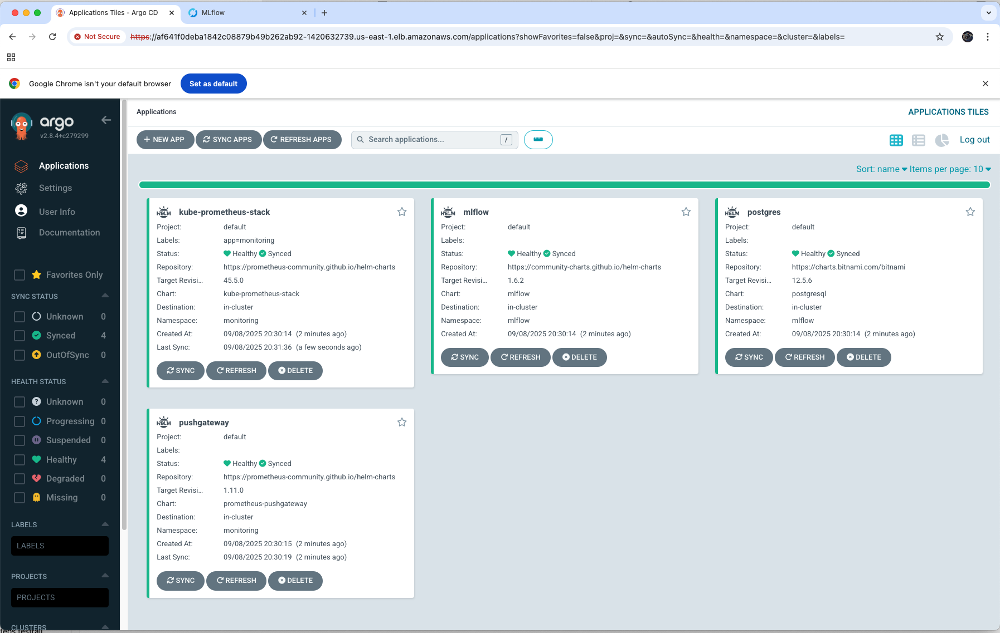
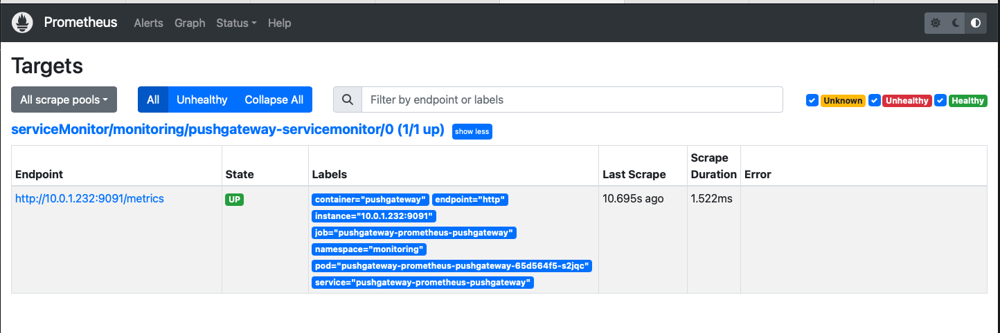
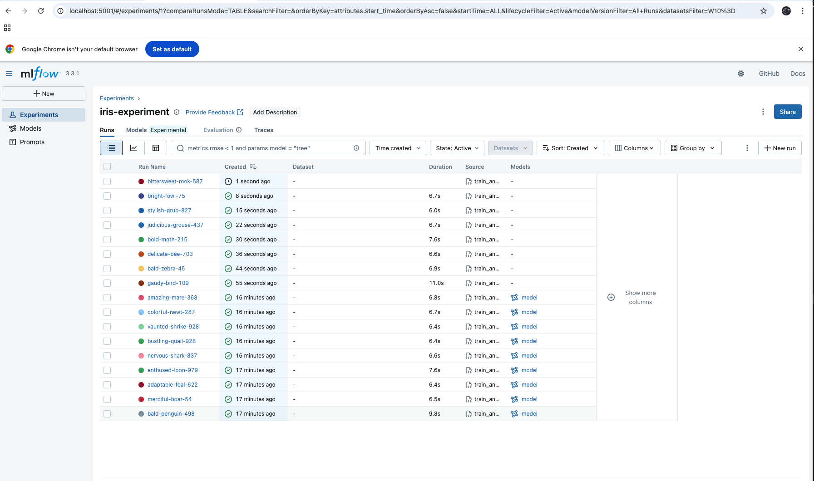
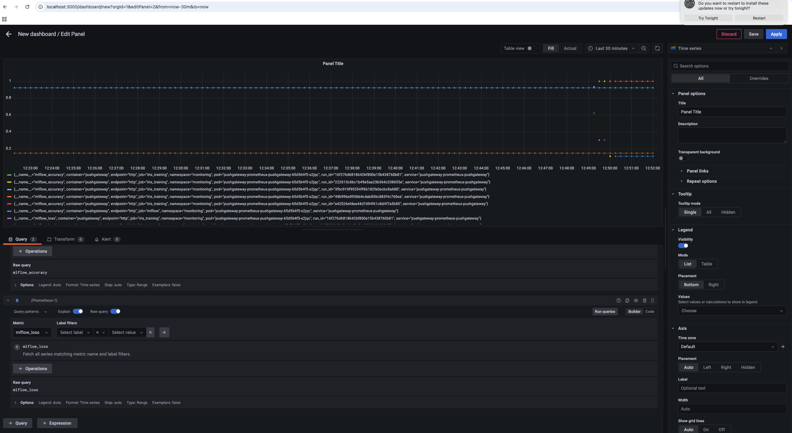
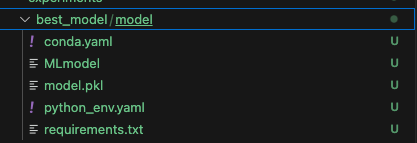

# Завданння 7

Для того щоб задеплоїти апплікейшн mlflow через ArgoCd та GIT

### 1. Для того щоб використати/застосувати EKS claster,VPC, argocd та інші необхідні ресурси :

```bash
terraform init
terraform plan
terraform apply
```

### 2. Створюемо всі необхідні апп в класері:

```bash
kubectl apply -f argocd/applications
```

Після цього перевірити що всі апп готові до використання



### 3. Перенаправляемо всі порти що нам потрібні(mlflow, pushgateway, prometheus, grafana):

```bash
kubectl port-forward svc/mlflow -n mlflow 5001:5000
kubectl port-forward svc/pushgateway-prometheus-pushgateway -n monitoring 9091:9091
kubectl port-forward svc/kube-prometheus-stack-prometheus -n monitoring 9090:9090
kubectl port-forward svc/kube-prometheus-stack-grafana -n monitoring 3000:80

```

### 4. Ставимо всі залежності та запускаемо локально скрипт:

```bash
pip install -r experiments/requirements.txt
python3 experiments/train_and_push.py
```

### 5. Перевіряемо що дані передаються в mlflow та grafana черз pushgateway -> prometheus:

## localhost:9090



## localhost:5000



## localhost:3000



### 6. Перевіряемо що найкраща модель записна в папці(best_model):



### 7. Знищуемо всі ресурси:

```bash
terraform destroy
```
