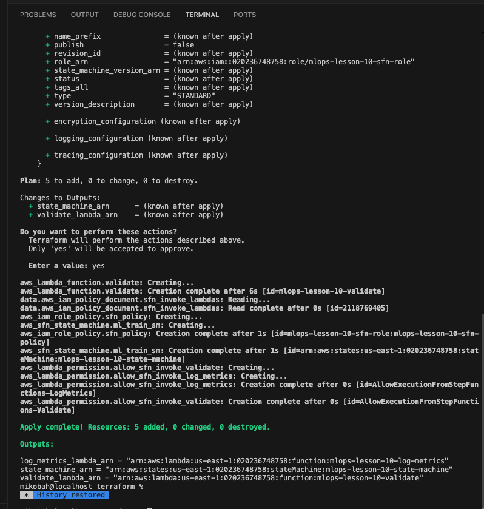
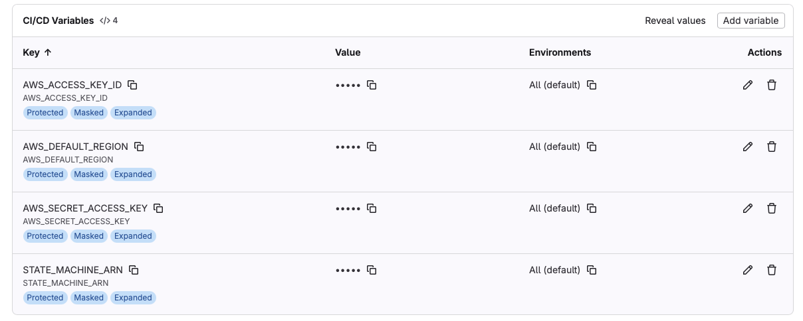
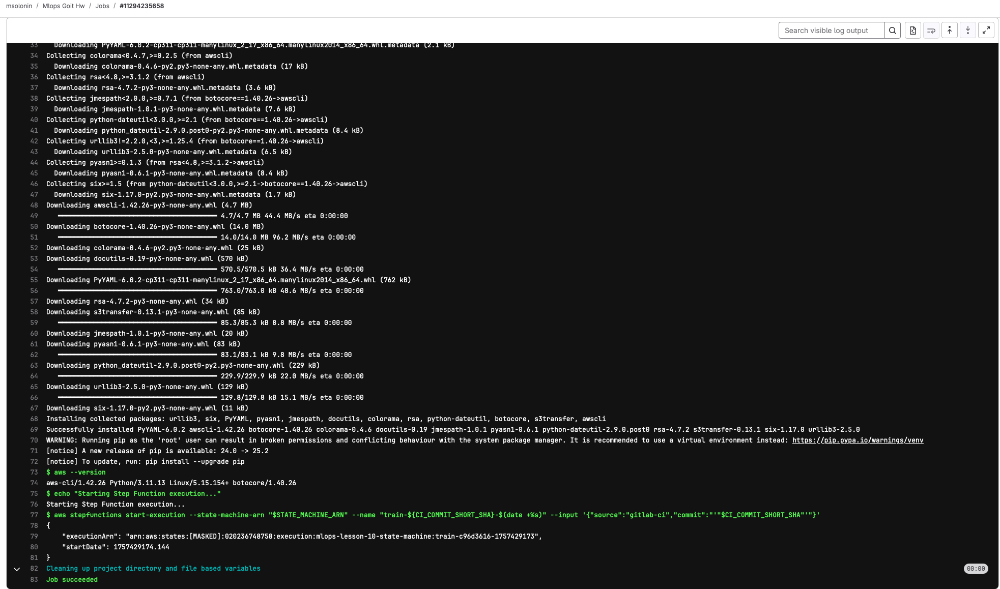
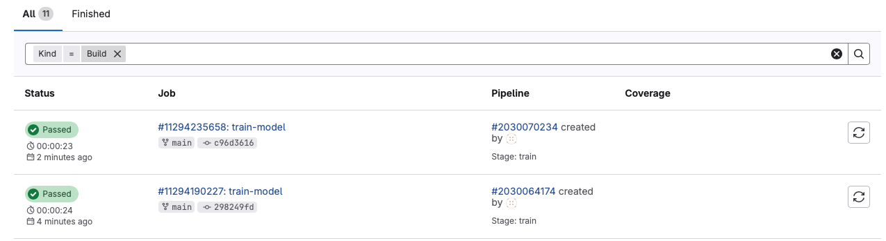

# Завданння 10

### 1. Для того щоб задеплоїти лямбда функції до AWS:

```bash
cd terraform
terraform init
terraform plan
terraform apply
```



### 2. Пушимо репозиторій в гітлаб:

[GitLab](https://gitlab.com/msolonin/mlops-goit-hw)

### 3. Добавляемо VARS в Gitlab:



### 4.Перевіряемо щоб білд проходив з state success:





В даній конфігурації перезбілка буде на зміни у всьому репозиторію,

якщо треба конкретна гілка змінюемо в файлі .gitlab-ci.yml на назву гілки

rules: - if: "$CI_COMMIT_BRANCH"

### 5. Знищуемо всі ресурси:

```bash
cd terraform
terraform destroy
```
