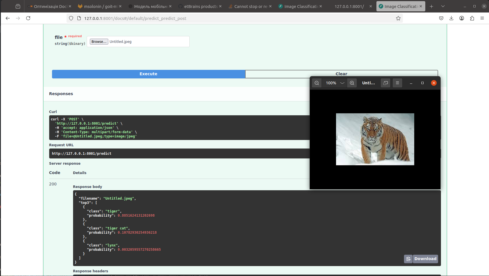

# Lesson-3:

Опис завдання
Ваша мета:

    Створити скрипт для встановлення Docker, Docker Compose, Python і ML-залежностей.
    Побудувати 2 Docker-образи для PyTorch‑моделі: «важкий» і оптимізований (slim).
    Створити простий inference-сервіс на Python з TorchScript-моделлю.
    Оформити короткий звіт у Markdown із порівнянням та аналізом.

# How-to Build/Start/Stop/Delete:
Для запуску скрипта що встановлюе всі залежності потрібно:
 * В папці із скриптом запустити термінал
 * Дати скрипту право на запуск: chmod +x install_dev_tools.sh
 * запустити скрипт з правами судо: sudo ./install_dev_tools.sh

Для того щоб збілдити fat або slim контейнер в залежності від обраної
 * Для fat: docker build -f Dockerfile.fat -t pytorch-stage:latest .
 * Для slim: docker build -f Dockerfile.slim -t pytorch-stage:latest .

Для того щоб запустити створений контейнер:
 * На той випадок якщо юзера не додано в группу докер(якщо додано можно без судо) та запск як демон щоб відпустити термінал: sudo docker run -d -p 8001:8001 pytorch-stage
 * Fastapi буде доступний за адресою:http://localhost:8001 
 * Також щоб перевірити модель користуемося swagger: http://localhost:8001/docs
 * Для зупинки контейнерів з імям pytorch-stage виконайте наступну команду: sudo docker ps -a | grep pytorch-stage | awk '{print $1}' | xargs -r sudo docker stop
 * Для видалення контейнерів з імям pytorch-stage виконайте наступну команду: sudo docker ps -a | grep pytorch-stage | awk '{print $1}' | xargs -r sudo docker rm -f
 * Для видалення образів з імям pytorch-stage виконайте наступну команду: sudo docker images | grep pytorch-stage | awk '{print $3}' | xargs -r sudo docker rmi -f

