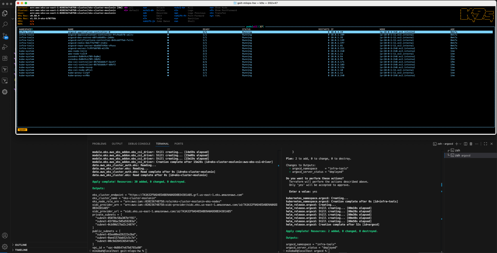
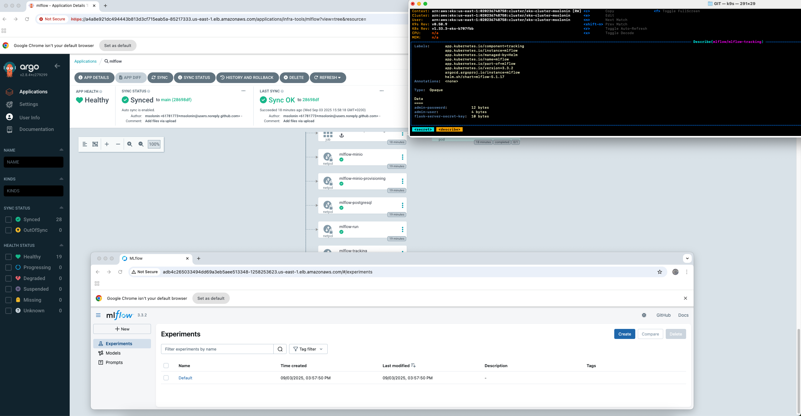

# Завданння 7

Для того щоб задеплоїти апплікейшн mlflow через ArgoCd та GIT

### 1. Для того щоб використати/застосувати EKS claster та інші необхідні ресурси (root folder):

```bash
terraform init
terraform plan
terraform apply
```

### 2. Заходимо в папку argocd та створюемо ArgoCd за допомогою тераформ:

```bash
cd argocd
terraform init
terraform plan
terraform apply
```

Після цього кластер буде готовий для використання



### 3. Заходимо в папку manifest та створюемо storage class:

kubectl apply -f sc.yaml

```bash
cd manifest
kubectl apply -f sc.yaml
```

### 4. Заходимо в папку manifest та піднімаемо APP mlflow з треком репозиторія GIT:

```bash
cd manifest
kubectl apply -f mlflow.yaml
```

Після цього апп створено в ArgoCd та до нього можна доступитися:



### 5. Знищуемо всі ресурси:

```bash
cd argocd
terraform destroy
```

In root folder:

```bash
terraform destroy
```
