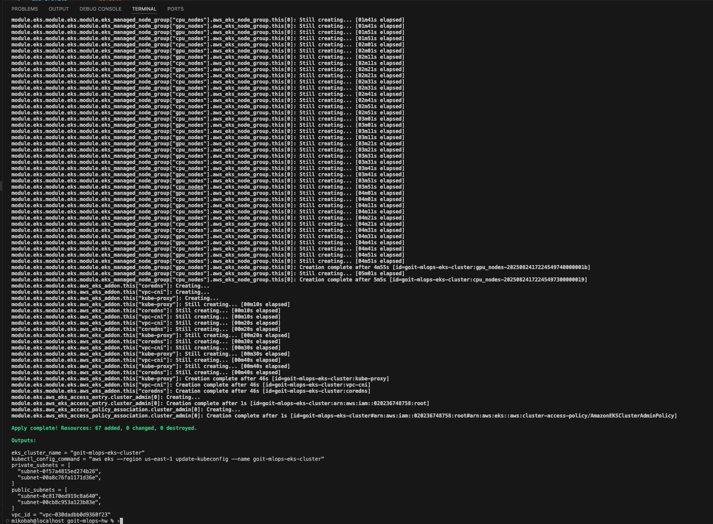
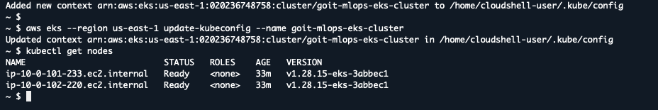
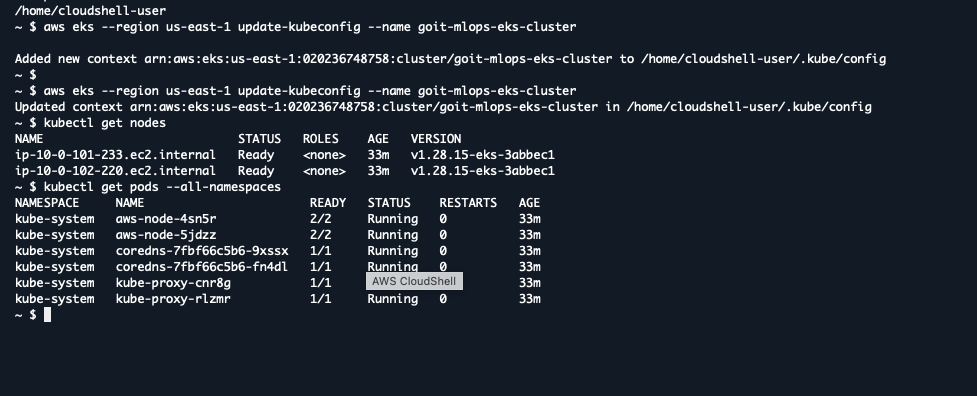

# Завданння 5

Використовувати модульну структуру Terraform-проєктів;
Автоматизувати створення VPC та EKS за допомогою готових модулів;
Навчитися створювати масштабовані node group-и для CPU та GPU задач;
Працювати з terraform_remote_state, outputs та providers;
Отримувати доступ до кластера через kubectl одразу після terraform apply.

### 1. Для того щоб використати/застосувати Terraform-проєкт:

```bash
terraform init
terraform plan
terraform apply
```



### 2. Перевірка створеного кластера EKS

```bash
kubectl get nodes
kubectl get pods --all-namespaces
```




