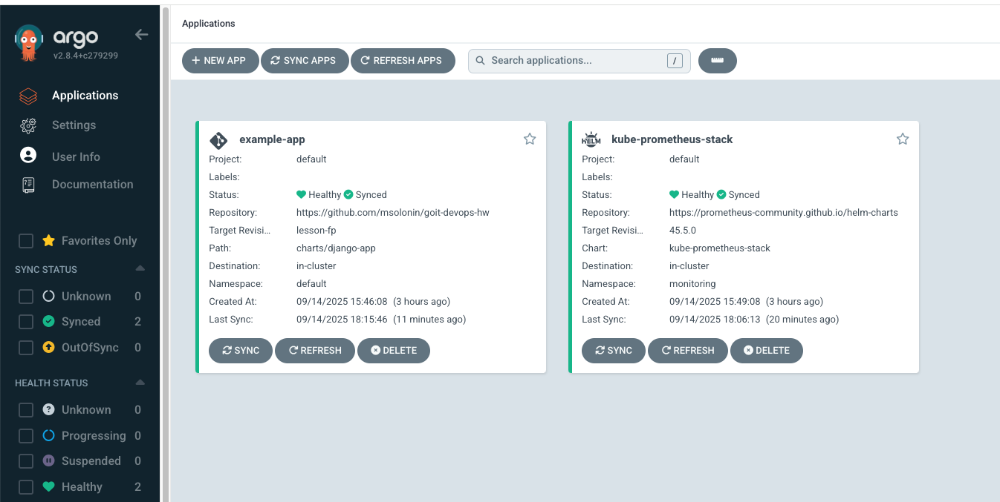
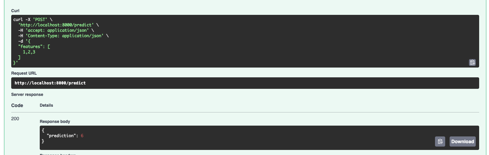
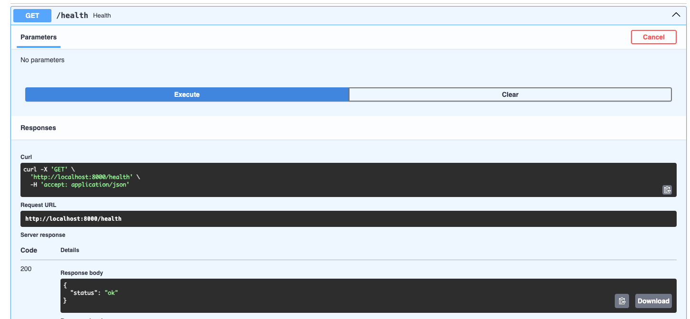
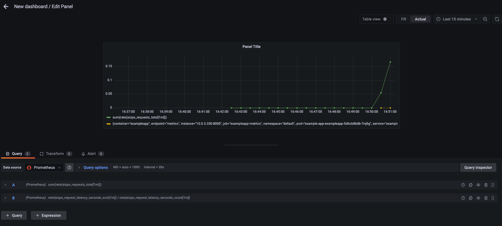
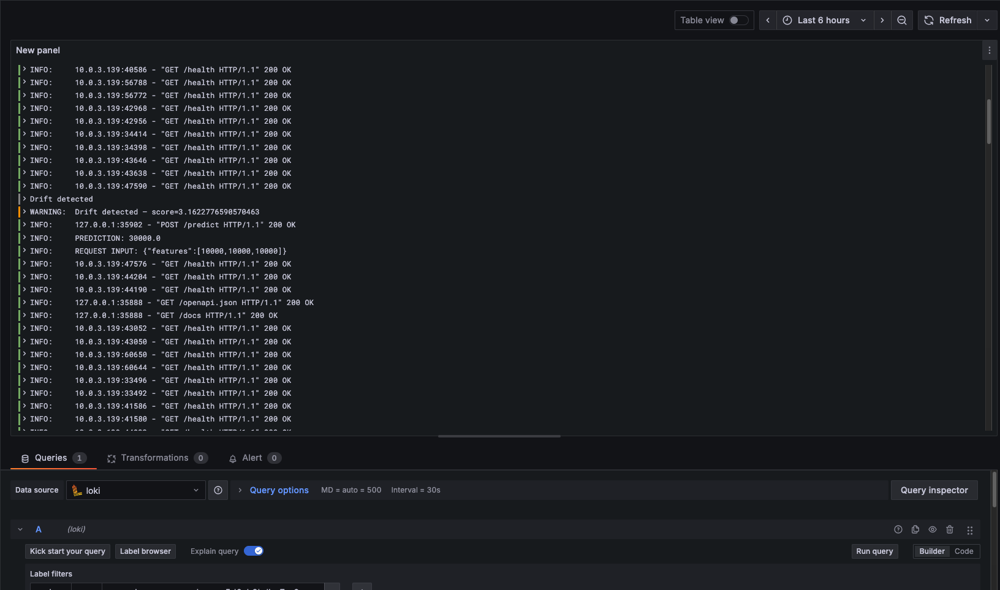
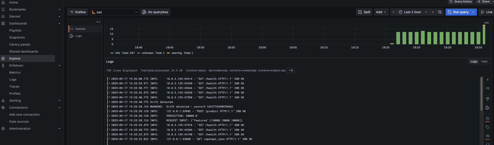
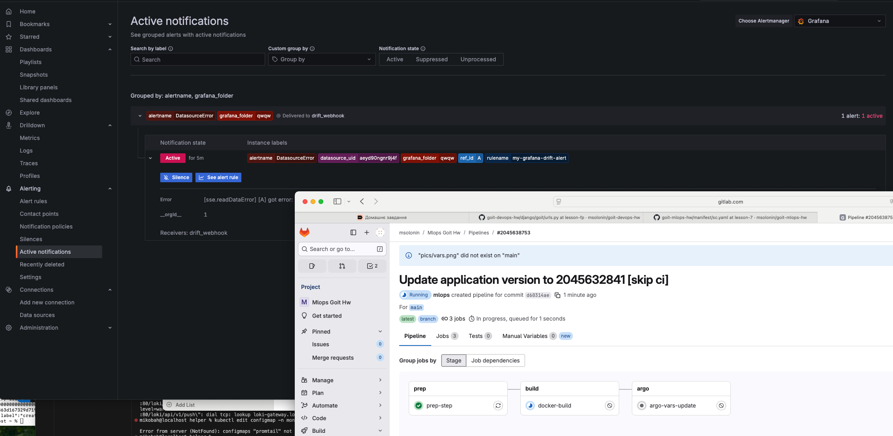
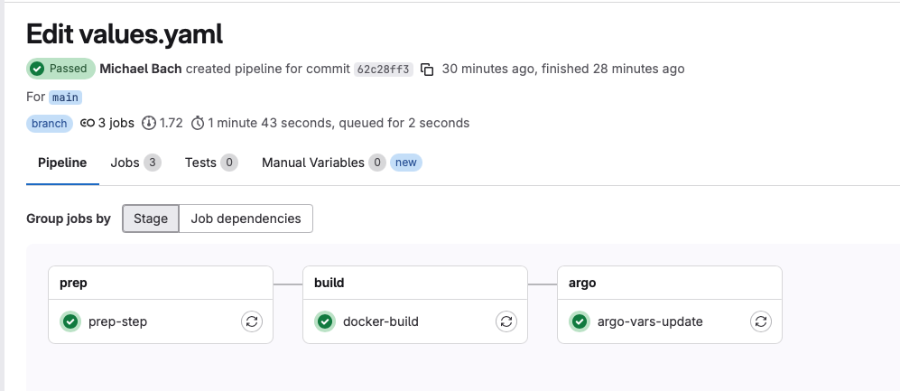
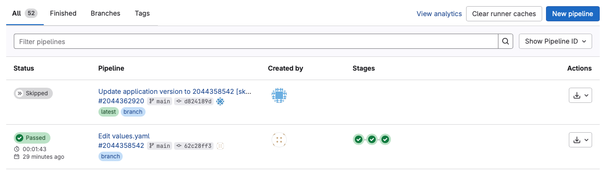

# Завданння Фінальний проект:

### 1. Для того щоб задеплоїти всі ресурси в авс тераформом eks, vpc, argocd (optional ecr):

Але в цьому проекті ми будемо використовувати вбудований docker registry з GitLab https://gitlab.com/msolonin/mlops-goit-hw/container_registry/9163815:

```bash
terraform init
terraform plan
terraform apply
```

### 2. Перевіряемо що наш апп піднятий в default NS:



```bash
kubectl apply -f helper
```

Це встанове всі додаткові апп що нам потрібні а саме:

- prometheus stack
- loki
- promtail
- servicemetrics, servicemonitor

Також перевіряемо роботу нашого апп:





### 3. Перевіряемо що метрики йдуть в prometheus:


### 4. Перевіряемо в графана метрики та логи:

Метрики:



Логи:





### 5. Перевіряемо роботу alert:

Добавляемо новий alertnotification point (webhook), перевіряемо його работу (Test webhook), після чого добавляемо його до нашого alert

Після створення alert, імітуемо drift даних за допомогою /predict [1000, 1000, 1000]

Бачимо що alert спрацював:



### 6. Перевіряемо роботу білда нових докер контейнерів за допомогою вебхука:



Також бачимо що працюе механізм що останній степ котрий після кожної збірки змінюе тег та пушить назад в репозиторій (для argo cd щоб при кожному дрифті була перезбірка DOckerfile)

Але це не запускае нову перезбірку і не виводить це в бескінечний цикл



### 7. Видаляемо всі ресурси:

```bash
terraform destroy
```
